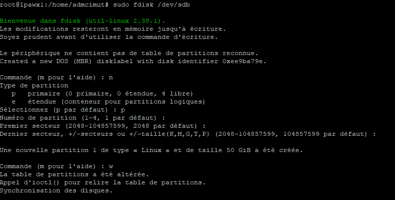

    OS:     DEBIAN 12
            lpawx1
            10.72.99.252
            4   vcpu
            4GB ram
            100GB HDD (ajout de 50GB)

Modif
    nano /etc/hostname
    nano /etc/hosts
    nano /etc/network/interfaces
    sudo reboot
        
    Ajout Disk
    sudo fdisk /dev/sdb
    n
    p
    w
    
